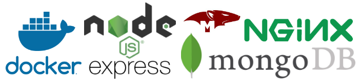

# Server Boilerplate

## License & Purpose

MIT License. This is something I've used in production before with success that I found useful for quickly bootstrapping RESTful APIs. You can fork and clone and take this apart without giving me any credit for anything. If you like it, you can star the repo or follow me on GitHub.

Make an issue or PR if you want to suggest ideas / fixes.

## About

This configuration is a backend [RESTful API](https://en.wikipedia.org/wiki/Representational_state_transfer) boilerplate with the following pieces:

- [Docker](https://www.docker.com/) as the container service to isolate the environment.
- [Node.js](https://nodejs.org/en/) (Long-Term-Support Version) as the run-time environment to run JavaScript.
- [Express.js](https://expressjs.com/) as the server framework / controller layer
- [MongoDB](https://www.mongodb.com/) as the database layer
- [Mongoose](https://mongoosejs.com/) as the "ODM" / model layer
- [NGINX](https://docs.nginx.com/nginx/admin-guide/content-cache/content-caching/) as a proxy / content-caching layer

## How to Install & Run

You will need to first download and install [Docker Desktop](https://www.docker.com/products/docker-desktop) or [Linux equivalent](https://docs.docker.com/install/linux/docker-ce/ubuntu/).

0.  Fork/Clone the repo
1.  Run `docker-compose up` to start three containers:
    - the MongoDB database container
    - the Node.js app container
    - the NGINX proxy container
1.  Server is accessible at `http://localhost:5000` if you have Docker for Windows or Mac. Use `http://localhost` without specifying the port to hit the NGINX proxy. On Linux, you may need to hit the IP Address of the docker-machine rather than `localhost` (port rules are the same.)

## App Structure

- the current entity is called "Thing" and all the routes are based on the thing resource. When you want to start building a real API, you can probably just do a global find and replace for thing, but mind the case-sensitivity.

**\_\_tests\_\_**

- this folder contains unit and integration tests both run using `npm test` which in turn uses [Jest](https://jestjs.io/)

**./app**

- `handlers` are Express.js route handlers that have `request`, `response`, and `next` parameters.
- `helpers` are raw JS "classes" and utility functions for use across the app
- `models` are [Mongoose schema](https://mongoosejs.com/docs/guide.html) definitions and associated models
- `routers` are RESTful route declarations using [express.Router module](https://expressjs.com/en/guide/routing.html) that utilize the functions in `handlers`
- `schemas` are [JSONSchema](https://json-schema.org/understanding-json-schema/index.html) validation schemas for creating or updating a Thing. Pro-tip: use [JSONSchema.net](https://jsonschema.net/) to generate schemas based on examples for you.
- `app.js` is what builds and configures the express app
- `config.js` is the app-specific config that you will want to customize for your app
- `index.js` is the entrypoint that actually starts the Express server

**./config**

- config contains NGINX proxy configuration, as well as the production pm2 configuration (the process-runner of choice)
